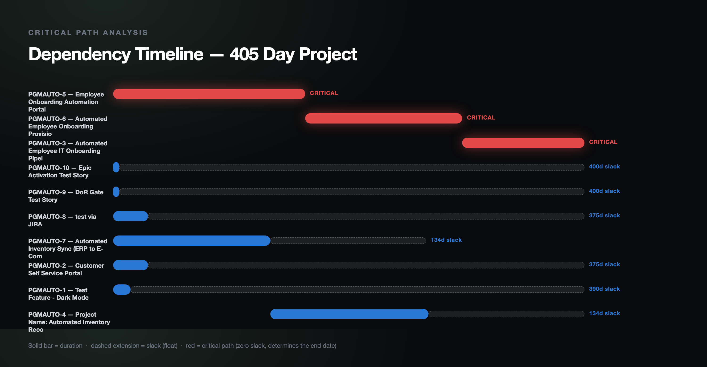
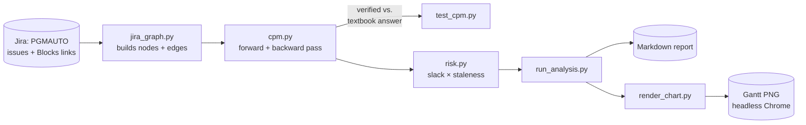

# Critical Path Radar

<div align="center">

[](https://www.python.org/)
[](https://developer.atlassian.com/)
[]()
[](tests/)

</div>

Real Critical Path Method (CPM) math — forward pass, backward pass, slack —
applied to actual Jira dependency links, not an LLM's guess at what's
"probably" at risk. The one thing every other agent in this portfolio
doesn't do: figure out algorithmically what actually determines the
project's end date, versus what merely looks urgent.

**Why this exists:** RAG status (`exec-status-rollup`) tells you a
workstream looks unhealthy. It can't tell you whether that workstream's
health *matters* to the delivery date — a stalled item with 300 days of
slack is a non-event; a stalled item with zero slack is the actual
emergency. That distinction requires real graph algorithms, not another
prompt. This is the algorithmically meatiest project in the series on
purpose — the clearest "a TPM who understands scheduling theory, not just
status collection" signal.

## Real output, against real (self-created) dependency data

The PGMAUTO Jira project had zero issue links before this project existed.
Created three real `Blocks` links via the Jira API to have a genuine graph
to analyze — [`sample_output.md`](sample_output.md) is the actual result:

**Critical path: `PGMAUTO-5 → PGMAUTO-6 → PGMAUTO-3`, 405 days.** The
inventory-sync chain (`PGMAUTO-7 → PGMAUTO-4`) carries 134 days of slack —
real, meaningful information a RAG-status view can't produce, because RAG
status has no concept of a dependency graph at all.



## Verified against a textbook answer, not just self-consistency

`cpm.py`'s forward/backward pass is checked against the standard 6-activity
CPM example used in project-management coursework, with an independently
known correct answer (critical path A→C→E→F, duration 19, B/D carry 2 days
of slack) — see [`tests/test_cpm.py`](tests/test_cpm.py). A wrong critical-path
algorithm is worse than none: it would confidently point leadership at the
wrong bottleneck. 10 unit tests total, all deterministic — there's no LLM
anywhere in the CPM or risk-scoring modules, so there's nothing for an
eval harness to grade here.

## Two real bugs found building this

1. **Got Jira's inward/outward link semantics backwards on the first pass.**
   Verified by fetching the raw API payload for both ends of the same link
   rather than trusting the docs' prose description: when issue X's own
   record contains an `inwardIssue` field, **X** plays the outward role
   (X blocks the named issue); an `outwardIssue` field on X's record means
   X is on the *inward* side (X is blocked by it) — exactly backwards from
   what seemed intuitive. Got this wrong initially, producing a fully
   reversed dependency graph that still ran without error — the kind of
   bug that's dangerous precisely because it fails silently, not loudly.
   Caught by manually inspecting real output against what I knew I'd
   created, not by a stack trace.
2. **Timezone-naive vs. timezone-aware datetime subtraction.** Jira's
   `duedate` field is a bare date (`"2026-10-31"`, no timezone) while
   `created` is a full offset-aware timestamp — subtracting them directly
   raises `TypeError`. Fixed by comparing at `.date()` granularity, which
   is all duration estimation needs anyway.

## Architecture



## Setup

```bash
python3 -m venv venv
source venv/bin/activate
pip install -r requirements.txt
python -m pytest tests/ -v
```

## Usage

```bash
python run_analysis.py
python run_analysis.py --out report.md
```

## Contact

<div align="center">

### **Navi Sohi**
*Technical Program Manager & Automation Engineer*

<br>

[](https://www.linkedin.com/in/navisohi/)
[](https://github.com/PlainJane20)
[](https://mail.google.com/mail/?view=cm&fs=1&to=nks.ai.dev@gmail.com)

<br>

</div>
